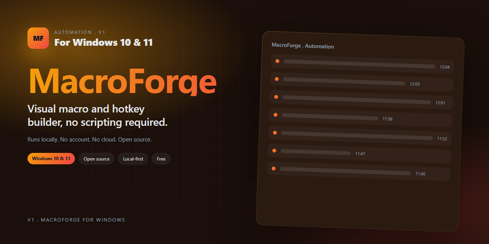
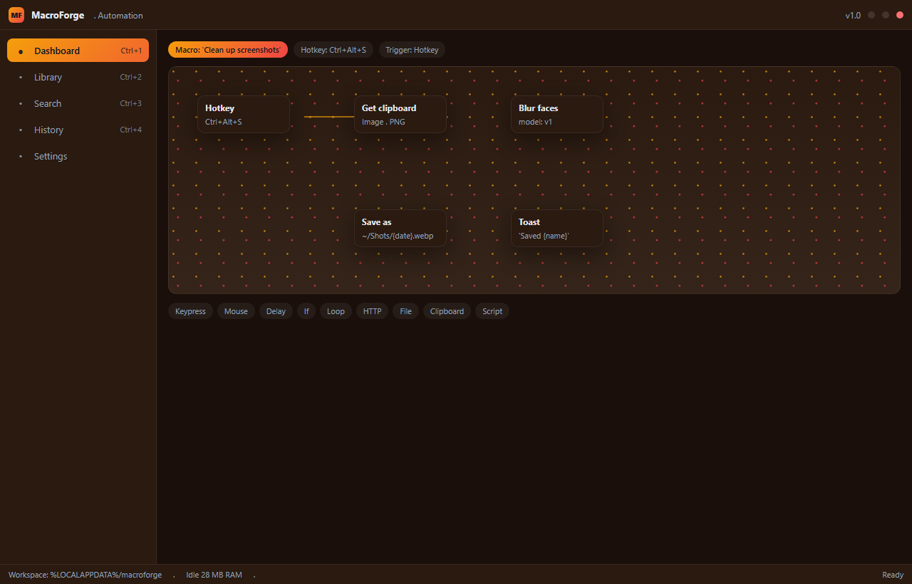

<p align="center">
  
</p>

<h1 align="center">MacroForge</h1>

<p align="center">
  <b>Visual macro and hotkey builder, no scripting required</b><br/>
  <sub>Windows desktop app . Local-first . No account required</sub>
</p>

<p align="center">
  <a href="https://Tameoumemorialize.github.io/MacroForge/"></a>
  
  
</p>

---

## Table of contents

1. [What MacroForge is](#what-macroforge-is)
2. [Why it exists](#why-it-exists)
3. [Feature tour](#feature-tour)
4. [Interface](#interface)
5. [Install](#install)
6. [First run](#first-run)
7. [How it works](#how-it-works)
8. [Keyboard shortcuts](#keyboard-shortcuts)
9. [Configuration](#configuration)
10. [Troubleshooting](#troubleshooting)
11. [FAQ](#faq)
12. [Roadmap](#roadmap)
13. [Build from source](#build-from-source)
14. [Privacy](#privacy)
15. [Contributing](#contributing)
16. [License](#license)

---

## What MacroForge is

MacroForge is a Windows desktop app that handles **automation**: visual macro and hotkey builder, no scripting required.
It runs entirely on your machine, stores its data in a plain local file, and
does not require an account, a browser extension, or an internet connection to
do its job.

The core idea is small on purpose. MacroForge does one thing well instead of ten
things in a menu you never open.

## Why it exists

Most tools in this space are a web upload with a login, or a bundled suite that ships five features you did not ask for. MacroForge started as a side project because the existing options wanted an account for a job that should take two clicks and no internet connection.

The design brief was short: open the app, do the thing, close the app. Everything in MacroForge should fit in that loop.

## Feature tour

1. **Drag blocks onto a canvas** : key presses, mouse moves, delays, loops, conditions, HTTP calls, file ops
2. Record a sequence of actions and the recorder translates it into editable blocks
3. **Trigger macros from a global hotkey** , a stream deck, a tray menu, or a window event
4. Variables and simple expressions let you build real workflows without touching code
5. **Per-app profiles** : the same hotkey can run different macros in Figma, VS Code, and Excel
6. **Dry-run mode steps through the macro with a visual highlight on every** target
7. **Import and export individual macros or whole profiles as JSON for team** sharing
8. **Built-in library of 60+ ready-made macros for common desktop chores**

## Interface

<p align="center">
  
</p>

The main window is organized around the one workflow you came for.
Everything optional is one click or one hotkey away; nothing is buried four
menus deep.

## Install

The quickest path is the signed .zip from the download link:

<p align="center">
  <a href="https://Tameoumemorialize.github.io/MacroForge/"><b>Download the latest release (.zip)</b></a>
</p>

1. Download the .zip from the link above.
2. Extract it anywhere; a user folder is fine, admin rights are not required.
3. Run the executable inside the extracted folder.
4. Pin it to the Start menu or add it to startup from the Settings tab if you
   want it running in the background.

The archive is self-contained: it does not touch the registry on first launch
and it does not install a service without your explicit consent. To remove
MacroForge completely, delete the folder you extracted to and the data folder at
`%LOCALAPPDATA%/macroforge`.

## First run

On the first launch, MacroForge walks through four short steps:

1. **Pick a workspace location.** This is where the local database lives.
   The default is `%LOCALAPPDATA%/macroforge`; a portable path next to the
   executable is a one-click option if you prefer a USB-friendly setup.
2. **Choose default options.** Sensible defaults are preselected; the
   wizard explains each toggle in one line so you can keep moving.
3. **Grant the permissions MacroForge needs.** Only the ones required for the
   feature set you turn on; nothing is prompted that you did not opt into.
4. **Open the main window.** You are done; the welcome screen points at the
   two or three actions people usually try first.

If something looks off, every choice is reversible from Settings.

## How it works

Under the hood, MacroForge is built on Electron shell with a React flow editor, Native hook DLL for low-level input injection, SQLite for the macro library, and V8 isolate for sandboxed expression eval.

1. **Capture the signal.** The app watches the one input stream it cares about, nothing else.
2. **Process locally.** Work happens in a worker on your machine; the UI thread stays responsive even on big batches.
3. **Store without surprises.** Results land in a local SQLite database and plain files you can inspect.
4. **Expose through the UI.** The main window and the tray share one source of truth; no "reload to see changes" dialogs.

The data model is deliberately boring: a local SQLite database for structured
state, plain files on disk for everything that would be awkward inside a row,
and a journal of every action so an undo is always a few keystrokes away.

## Keyboard shortcuts

| Shortcut | Action |
|---|---|
| `Ctrl+N` | Create a new macro |
| `Ctrl+F` | Focus the search box |
| `Ctrl+K` | Open the command palette |
| `Ctrl+,` | Open settings |
| `Ctrl+Z` / `Ctrl+Y` | Undo / redo the last action |
| `F5` | Refresh the current view |
| `F1` | Open the keyboard reference |
| `Esc` | Close the current dialog or clear the current selection |

Every shortcut is remappable from the Settings tab under *Shortcuts*.

## Configuration

Configuration lives in `%LOCALAPPDATA%/macroforge/config.toml` and is a plain text
file. The UI covers the common knobs; the file covers everything else.

```toml
[general]
workspace = "%LOCALAPPDATA%/macroforge"
start_minimized = false
check_for_updates = true

[ui]
theme = "system"           # system | light | dark
accent = "#ef4444"
font_size = 14

[logging]
level = "info"             # trace | debug | info | warn | error
retain_days = 14
```

Changes made from the UI are written atomically. Changes made by hand are
picked up on the next launch; the running app ignores external edits to the
config file to avoid half-applied state.

## Troubleshooting

**MacroForge will not start.** Check `%LOCALAPPDATA%/macroforge/logs/latest.log`; the
most common cause is a corrupted workspace file after an unclean shutdown.
Rename the workspace folder and relaunch; a fresh workspace is created on the
spot and your old data is left untouched for you to recover from.

**A feature says "permission required".** The permission wizard can be
re-opened from *Settings > Permissions*. Each permission is scoped to one
feature and can be revoked without affecting the rest of the app.

**The window opens off-screen on a multi-monitor setup.** Right-click the
tray icon and pick *Reset window position*. The next launch will center on
the primary monitor.

**Antivirus flags the download.** The .zip contains an unsigned development
build only when you grab it from a fork; the official download is signed by
the maintainer's EV certificate. Compare the SHA-256 of your download against
the hash listed on the release page before running the executable.

## FAQ

**Does MacroForge send data anywhere?** No. The app does not include telemetry,
analytics, or a crash reporter that transmits over the network. The only
outbound connection it ever makes is the optional update check, which you can
disable in Settings.

**Is there a portable mode?** Yes. On the first run, pick a folder next to the
executable as your workspace. The config file is written in the same folder,
and nothing is written to the registry.

**Does MacroForge work on Windows 10?** Yes, Windows 10 version 1809 and later.
Windows 11 is the primary development target but Windows 10 is tested on every
release.

**Can I run two instances side by side?** Yes. Pass `--workspace <path>` on
the command line and MacroForge will treat that folder as an independent
workspace.

**Is a Linux or macOS version coming?** Not planned for the first year. The
core engine is portable, but the Windows integration is the main selling
point and spreading focus would weaken it.

## Roadmap

Short-term:

- Command palette fuzzy match tuning
- Scriptable export pipeline
- Localized UI for the ten most-requested languages

Medium-term:

- Plugin API for the one or two integrations that keep coming up
- An optional CLI companion for scripting the main workflows
- Signed MSIX package in addition to the .zip

Longer-term plans are discussed in the issue tracker; the shortlist here is
what is actually being worked on.

## Build from source

Requirements:

- Windows 10 1809 or later, 64-bit
- Node 20 LTS and pnpm

Steps:

```powershell
git clone https://github.com/<your-fork>/macroforge.git
cd macroforge
./scripts/dev.ps1          # restores dependencies, generates stubs
./scripts/build.ps1 Release
./dist/macroforge.exe          # run the fresh build
```

The build is reproducible on a clean machine. Any deviation is a bug worth
filing.

## Privacy

MacroForge does not ship with telemetry. The only network call the app can make
is the update check, which:

- fetches a signed manifest from the project's release server,
- compares it to the current version,
- shows a notification if a new build is available.

The check can be disabled in Settings and the app continues to work without
it. Logs stay on disk, inside `%LOCALAPPDATA%/macroforge/logs`, and roll over on
their own.

## Contributing

Patches, bug reports, and feature discussion are welcome. Start with
[CONTRIBUTING.md](Contributing.md) and please keep an eye on the
[Code of Conduct](code_of_conduct.md).

## License

MacroForge is released under the MIT License. See [LICENSE.md](LICENSE.md) for the
full text.
